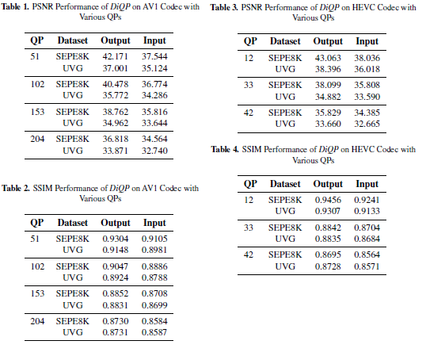
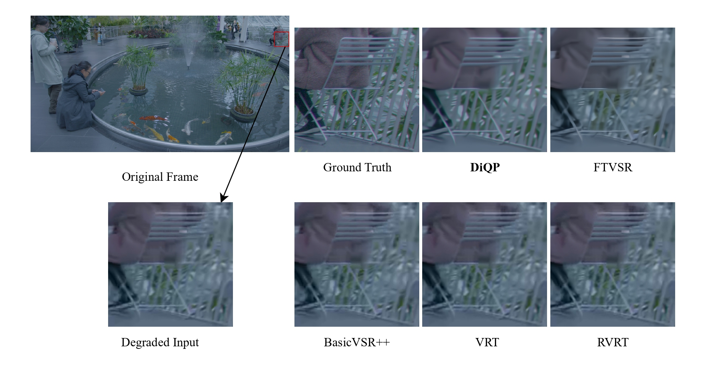

[](https://paperswithcode.com/sota/video-restoration-on-sepe-8k?p=reversing-the-damage-a-qp-aware-transformer)
[](https://paperswithcode.com/sota/video-restoration-on-uvg?p=reversing-the-damage-a-qp-aware-transformer)
[](https://arxiv.org/abs/2412.08912)
[](LICENSE)
[](https://www.python.org/)
[]([LICENSE](https://userful.com))


# Reversing the Damage: A QP-Aware Transformer-Diffusion Approach for 8K Video Restoration under Codec Compression (DiQP, Oral WACV 2025)

**Official Pytorch repository for "Reversing the Damage: A QP-Aware Transformer-Diffusion Approach for 8K Video Restoration under Codec Compression"**

**Updates:**
- March 17, 2025: We publicly released the trained weights [`Check Here`](pretrained).

This repository provides the codebase, pretrained models, and experimental results for our novel approach to restoring ultra-resolution (8K) videos degraded by codec compression.


*Figure 1: As the QP increases, the overall quality decreases, leading to more noticeable artifacts. Pixels are affected differently relative to each other. We calculated the Mean Absolute Difference and PSNR for these four quality levels and also present a heatmap of the affected areas.*

## Table of Contents
- [Key Contributions](#key-contributions)
- [Model Architecture](#model-architecture)
- [Installation and Setup](#installation-and-setup)
  - [Prerequisites](#prerequisites)
  - [Environment](#environment)
  - [Dataset](#dataset)
- [Usage](#usage)
  - [Training](#training)
  - [Testing](#testing)
  - [Pretrained Weights](#pretrained-weights)
  - [Dataset Directory Structure](#dataset-directory-structure)
- [Experiments](#experiments)
- [Results](#results)
- [Citation](#citation)
- [Contact us](#contact-us)

## Key Contributions
- A novel Transformer-Diffusion model for 8K video restoration.

- First model to address codec artifacts (`AV1`, `HEVC`) using Denoising Diffusion without additional noise.

- Incorporates "`Look Ahead`" and "`Look Around`" modules for improved detail reconstruction and visual quality.

- Demonstrated superior performance over state-of-the-art methods on 4K and 8K videos.

- Comprehensive evaluation on SEPE8K and UVG datasets.


## Model Architecture


*Figure 2: The overall architecture of DiQP.*


## Installation and Setup

### Prerequisites
- Python 3.10+
- Conda
- CUDA-enabled GPU
- ffmpeg (for Encoding and Decoding videos)

1. **Environment:**
   - Create a conda environment using the provided `environment.yml` file:
     ```bash
     conda env create -f environment.yml
     conda activate diqp 
     ```
   - `ffmpeg` with CUDA-enabled especially for `AV1` since not all GPUs support it. For more details please check this [website](https://developer.nvidia.com/video-encode-and-decode-gpu-support-matrix-new).

2. **Dataset:**
   - Download the SEPE-8K dataset from [here](https://github.com/talshoura/SEPE-8K-Dataset).
   - Ensure your data follows the specified directory structure ([see below](#dataset-directory-structure)).
   - Use `encode.py` and `decode.py` in [`videoRelated`](videoRelated) directory to create and process frames.

## Usage

### Training
- Run the `train.py` script to train the model.
- Required parameters already set into the code

### Testing
- Run the `test.py` script to evaluate the model on test data.

### Pretrained Weights
- For access to the pretrained weights for `HVEC` and `AV1` models , please contact us.

### Dataset Directory Structure

Your dataset should be organized as follows:
```
Raw:
├── 01
│   ├── 000_8K.png
│   ├── 001_8K.png
│   ├── 002_8K.png
│   └── ...
├── 02
│   ├── 000_8K.png
│   ├── 001_8K.png
│   ├── 002_8K.png
│   └── ...
└── ...
Encoded:
├── 01
│   ├── QP-X
│   │   ├── 000_8K.png
│   │   ├── 001_8K.png
│   │   ├── 002_8K.png
│   │   └── ...
│   ├── QP-X+n
│   │   ├── 000_8K.png
│   │   ├── 001_8K.png
│   │   ├── 002_8K.png
│   │   └── ...
├── 02
│   ├── QP-X
│   │   ├── 000_8K.png
│   │   ├── 001_8K.png
│   │   ├── 002_8K.png
│   │   └── ...
│   ├── QP-X+n
│   │   ├── 000_8K.png
│   │   ├── 001_8K.png
│   │   ├── 002_8K.png
│   │   └── ...
└── ...
```
**Replace `QP-X` and `QP-X+n` with the actual quantization parameter values.**

## Experiments
The [`videoRelated`](videoRelated) directory contains code and data for experiments on:

- Optimizing the 'Look Ahead' model's T parameter.
- Encoding and Decoding RAW frames to required QP values.

## Results


*Figure 3: Quantitative results compared to other models.*



*Figure 3: Performance of DiQP on other QP values.*



*Figure 4: Comparison of visual quality produced by different methods on sequence 5 of the SEPE8K dataset.*


*Figure 5: Comparison of visual quality produced by different methods on the Race Night sequence of the UVG dataset.*


*Figure 6: Comparison of visual quality produced by different methods on sequence 26 of the SEPE8K dataset.*


## Citation
If you find this work helpful, please consider citing it and giving the repository a star! ⭐

```bibtex
@InProceedings{Dehaghi_2025_WACV,
    author    = {Dehaghi, Ali Mollaahmadi and Razavi, Reza and Moshirpour, Mohammad},
    title     = {Reversing the Damage: A QP-Aware Transformer-Diffusion Approach for 8K Video Restoration under Codec Compression},
    booktitle = {Proceedings of the Winter Conference on Applications of Computer Vision (WACV)},
    month     = {February},
    year      = {2025},
    pages     = {1258-1267}
}
```
## Contact us
For any inquiries please reach out to us at ali.mollaahmadidehag@ucalgary.ca
